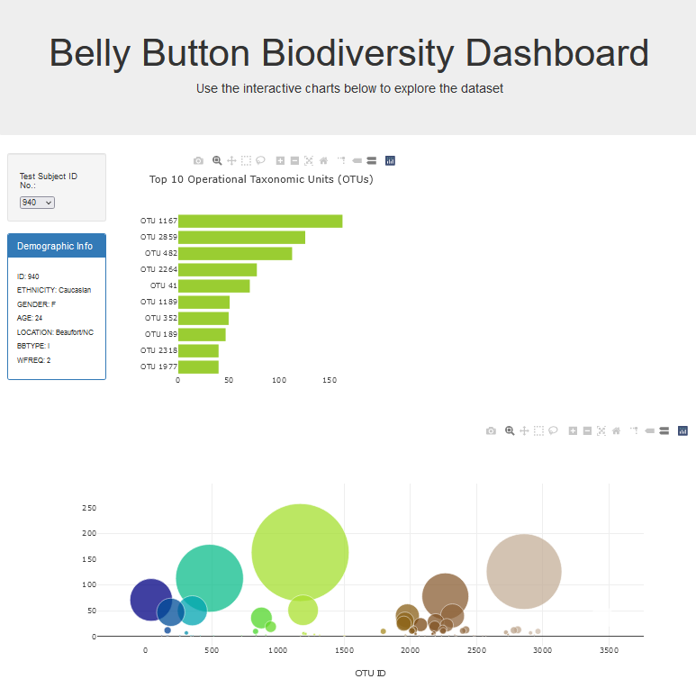

# belly-button-challenge

## GitHub Pages
https://khogle.github.io/belly-button-challenge/ 

## Goal
This project’s goals were to take data from a URL json on bacteria in the belly buttons taken from a sample of individuals and create charts that represented the bacteria found in each individual which changed with a dropdown selector of the different individuals. 

## Screenshot of Result

### List of sources:
    *Tutor Kourt Bailey and La Luna assisted. Kourt specifically helped me understand the primary function set up and Luna assisted in why my demographics were not printing accurately
    *For Hover Text: https://codepen.io/plotly/pen/vOvQyE and https://plotly.com/javascript/bar-charts/
    *For Bubble Charts: https://plotly.com/javascript/bubble-charts/
    *For Colorscale: https://plotly.com/javascript/colorscales/
    *Used as an explanation tool during tutoring session: https://www.w3schools.com/tags/tag_select.asp

